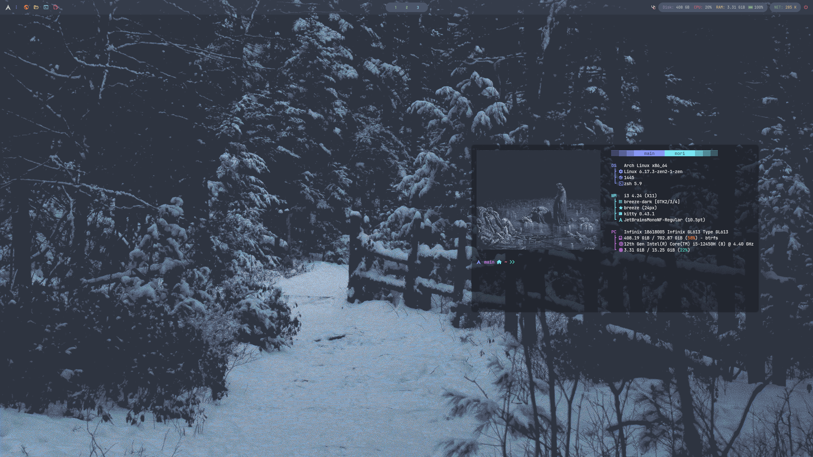

# merewrrow~~
my dots for i3wm

package stack: ```sudo pacman -Syu kitty btop xclip picom rofi git fastfetch fzf nvim```

# install guide:

- 1: ```git clone https://github.com/insvrg3ncy/insvrg3ncy-dots.git```
- 2: ```cd insvrg3ncy-dots```
- 3: ```cp -r .config ~/.config && mkdir -p Pictures/anal && cp -r Pictures ~/Pictures```

you can use i3status instead of polybar, js uncomment the bar section in `.config/i3/config`, and comment the polybar exec

# scr's:



### stay rawr~

thanks [gh0stzk](https://github.com/gh0stzk) for his awesome rofi themes and polybar <3
